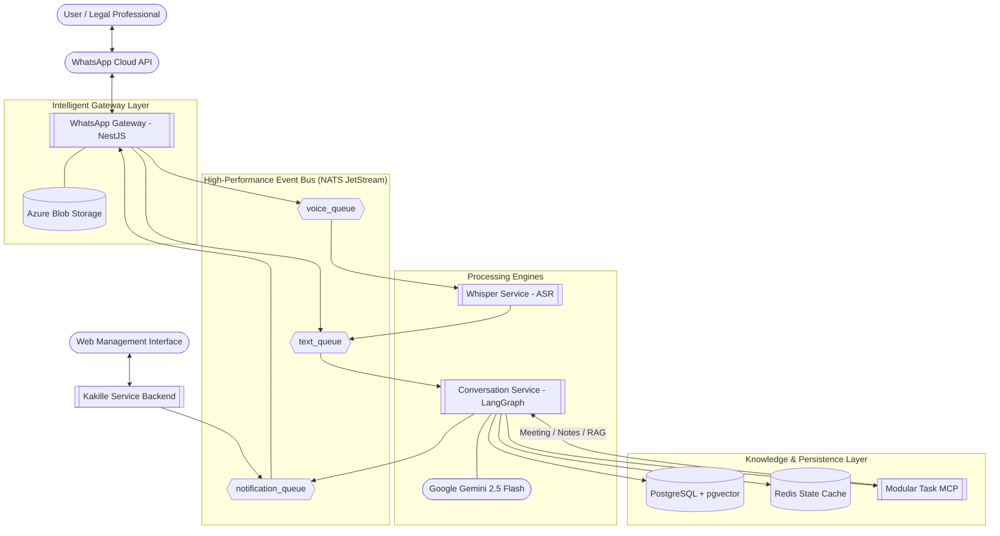
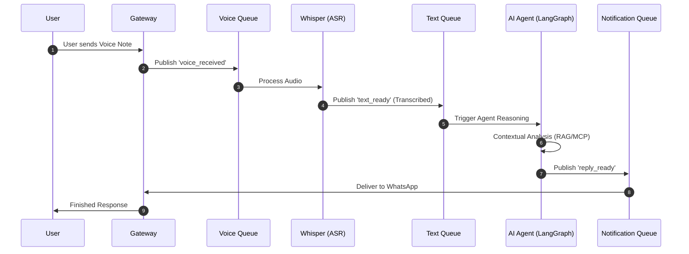

# Technical Proposal & System Architecture: theKade-LegalAid

## 1. Executive Summary
theKade-LegalAid is a cutting-edge, AI-powered legal assistance platform designed to democratize access to legal knowledge. By combining the accessibility of WhatsApp with the power of Large Language Models (LLMs) and a robust event-driven microservices architecture, the platform provides real-time, context-aware legal guidance, automated scheduling, and document management. This proposal outlines the technical foundation and the strategic roadmap for the platform.

---

## 2. Strategic System Architecture

The platform is built on an **Event-Driven Microservices Architecture**, ensuring high availability, fault tolerance, and the ability to process complex, multi-modal legal queries asynchronously.

### 2.1 High-Level Architecture Diagram

---

## 3. Technology Stack Deep Dive

theKade-LegalAid utilizes a curated stack of modern, enterprise-grade technologies selected for their performance and developer productivity:

### 3.1 Core Technologies
- **NestJS (Node.js)**: Powers the WhatsApp Gateway and the upcoming **Kakille Service** (Web Management backend).
- **Python & LangGraph**: The core AI logic. LangGraph enables stateful, multi-turn agentic conversations.
- **Whisper ASR**: OpenAI's state-of-the-art speech recognition model for high-precision voice-to-text transcription.
- **Google Gemini 2.5 Flash**: Lightning-fast inference with a massive 1M+ token context window.
- **NATS JetStream**: Persistent, high-performance messaging with dedicated subjects for `voice`, `text`, and `notifications`.

### 3.2 Data & Storage
- **PostgreSQL + pgvector**: Unified relational and vector database for RAG (Retrieval-Augmented Generation).
- **Redis**: High-speed checkpointing and user session persistence.
- **Modular MCP (Model Context Protocol)**: Decoupled tool server providing Meeting, Note-taking, and Knowledge Base search capabilities.

---

## 4. Key Feature Set & Roadmap

### 4.1 🎙️ Multi-Modal Intelligence
- **Intelligent Voice Flow**: Voice notes published to `voice_queue` are transcribed by Whisper and re-published to `text_queue` for seamless processing by the AI agent.
- **Document OCR & Analysis**: Automated scanning of legal documents to extract key clauses.

### 4.2 🔍 Retrieval-Augmented Generation (RAG)
- **Verified Legal Corpus**: Queries a private, curated database of Sri Lankan laws.
- **Citation Engine**: Provides direct references to statutes and sections mentioned in advice.

### 4.3 📅 Automated Legal Operations
- **Modular Tooling**: The Task MCP Server provides a clean interface for scheduling and documentation.

---

## 5. Industrial-Grade Event Flow

### 5.1 Voice Processing Sequence

---

## 6. Security, Compliance & Scalability
- **End-to-End Encryption**: WhatsApp's secure channel.
- **Audit Logging**: Comprehensive trace of AI decisions and tool usage.
- **Service Isolation**: Each queue consumer (Whisper, Agent, Gateway) scales independently.
