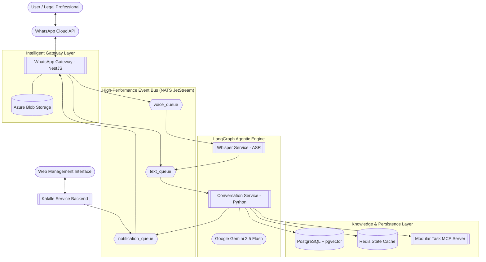
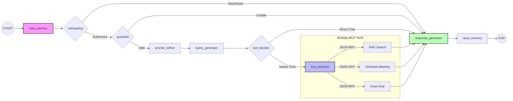
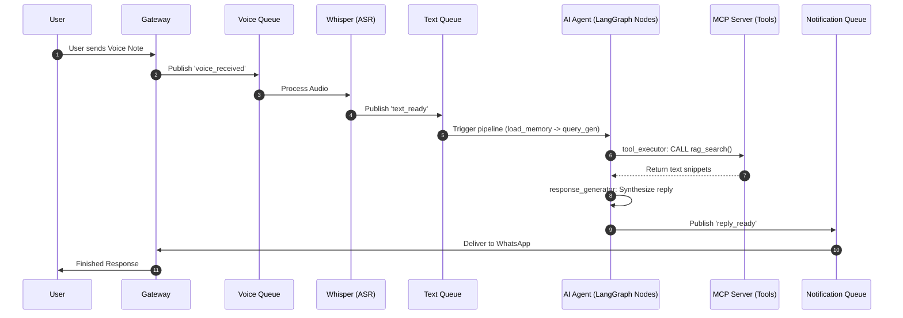

# Technical Proposal & System Architecture: theKade-LegalAid

## 1. Executive Summary
theKade-LegalAid is a cutting-edge, AI-powered legal assistance platform designed to democratize access to legal knowledge. By combining the accessibility of WhatsApp with the power of Large Language Models (LLMs) and a robust event-driven microservices architecture, the platform provides real-time, context-aware legal guidance, automated scheduling, and document management. This proposal outlines the technical foundation and the strategic roadmap for the platform.

---

## 2. Strategic System Architecture

The platform is built on an **Event-Driven Microservices Architecture**, ensuring high availability, fault tolerance, and the ability to process complex, multi-modal legal queries asynchronously.

### 2.1 High-Level Architecture Diagram

---

## 3. LangGraph Node Architecture

The **Conversation Service** utilizes a sophisticated LangGraph pipeline to handle complex multi-turn reasoning and tool orchestration.

### 3.1 Internal Node Flow & MCP Integration

---

## 4. Technology Stack Deep Dive

### 4.1 Core Technologies
- **NestJS (Node.js)**: Powers the WhatsApp Gateway and the upcoming **Kakille Service**.
- **Python & LangGraph**: The core AI logic. LangGraph enables stateful, multi-turn agentic conversations via dedicated nodes.
- **Whisper ASR**: OpenAI's state-of-the-art speech recognition model.
- **Modular MCP**: Standalone tool server providing Meeting, Note-taking, and Knowledge Base search.

### 4.2 Data & Storage
- **PostgreSQL + pgvector**: Unified relational and vector database for RAG.
- **Redis**: High-speed checkpointing and **Conversation Memory** persistence (Messages + Follow-up context).

---

## 5. Industrial-Grade Event Flow

### 5.1 Voice Processing Sequence

---

## 6. Security, Compliance & Scalability
- **End-to-End Encryption**: WhatsApp's secure channel.
- **Node-Level Isolation**: LangGraph nodes are stateless and fetch context from Redis, allowing for horizontal scaling of the reasoning engine.
- **Service Isolation**: Each queue consumer (Whisper, Agent, Gateway) scales independently.
