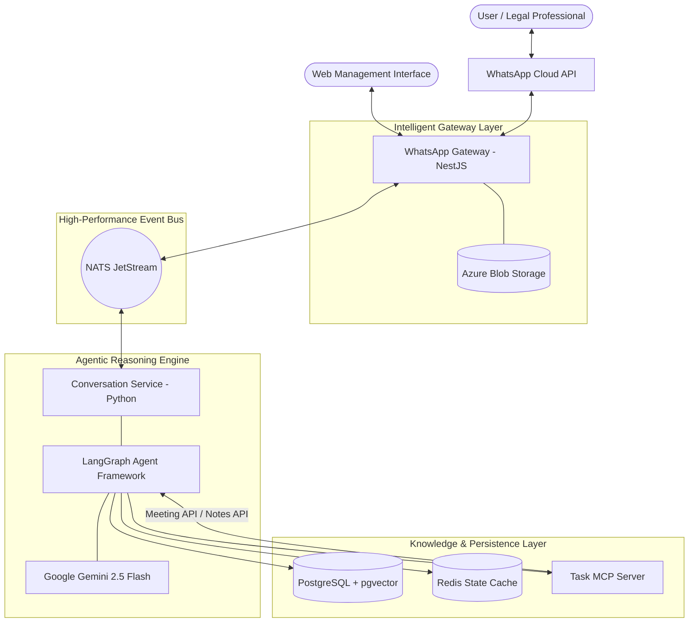
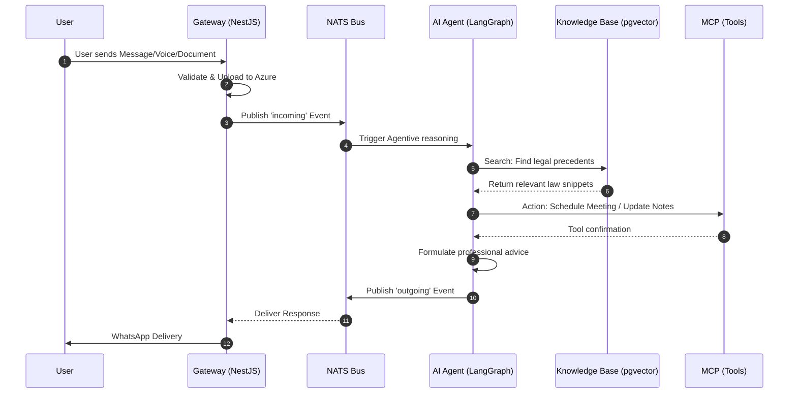

# Technical Proposal & System Architecture: theKade-LegalAid

## 1. Executive Summary
theKade-LegalAid is a cutting-edge, AI-powered legal assistance platform designed to democratize access to legal knowledge. By combining the accessibility of WhatsApp with the power of Large Language Models (LLMs) and a robust event-driven microservices architecture, the platform provides real-time, context-aware legal guidance, automated scheduling, and document management. This proposal outlines the technical foundation and the strategic roadmap for the platform.

---

## 2. Strategic System Architecture

The platform is built on an **Event-Driven Microservices Architecture**, ensuring high availability, fault tolerance, and the ability to process complex, multi-modal legal queries asynchronously.

### 2.1 High-Level Architecture Diagram

---

## 3. Technology Stack Deep Dive

theKade-LegalAid utilizes a curated stack of modern, enterprise-grade technologies selected for their performance and developer productivity:

### 3.1 Core Technologies
- **NestJS (Node.js)**: Used for the WhatsApp Gateway. Its modular architecture allows for clean separation of concerns and easy horizontal scaling.
- **Python & LangGraph**: The core AI logic is implemented in Python, leveraging LangGraph for stateful, multi-turn agentic conversations. This allows the AI to maintain context over long discussions.
- **Google Gemini 2.5 Flash**: Chosen for its superior reasoning capabilities, lightning-fast inference, and massive 1M+ token context window, which is critical for analyzing long legal documents.
- **NATS JetStream**: Provides a distributed, persistent message bus. It ensures that no user message is lost, even during system updates or service failures.

### 3.2 Data & Storage
- **PostgreSQL with pgvector**: A unified solution for relational data and high-dimensional vector embeddings. This powers our semantic search (RAG), allowing the AI to find relevant legal precedents in milliseconds.
- **Redis**: Acts as the high-speed state store. It persists conversation "checkpoints," allowing the AI to resume exactly where it left off.
- **Azure Blob Storage**: Secure, scalable storage for all multimedia assets (voice notes, legal PDFs, evidence photos).

---

## 4. Key Feature Set & Roadmap

### 4.1 🎙️ Multi-Modal Intelligence
- **Intelligent Voice Processing**: Real-time transcription of voice notes using state-of-the-art ASR (Automatic Speech Recognition).
- **Document OCR & Analysis**: Automated scanning of legal documents to extract key clauses, dates, and parties using AI-driven vision and text extraction.

### 4.2 🔍 Retrieval-Augmented Generation (RAG)
- **Verified Legal Corpus**: The system queries a private, curated database of laws and case studies, ensuring all advice is grounded in actual legal facts rather than model predictions.
- **Citation Engine**: (Planned) The AI will provide direct references to statutes and sections mentioned in its advice.

### 4.3 📅 Automated Legal Operations
- **Smart Calendar Integration**: Seamlessly schedule appointments with legal counsel via the Task MCP Server.
- **Automated Case Notes**: Every interaction is automatically summarized into a professional "Case Brief," saving legal professionals hours of manual documentation.

### 4.4 🌐 Real-time Legal Search
- **Live Precedent Fetching**: Integration with web-search tools to incorporate the very latest court rulings and legislative changes.

---

## 5. Industrial-Grade Event Flow

The system's reliability stems from its asynchronous backbone. Each step in the process is an independent event, allowing for parallel processing and robust error recovery.

---

## 6. Security, Compliance & Scalability
- **End-to-End Encryption**: Leveraging WhatsApp's secure channel for the final mile of communication.
- **AES-256 Storage**: All documents in Azure Blob Storage are encrypted at rest.
- **Horizontal Scalability**: Each component (Gateway, Agent, DB) can be scaled independently to handle millions of users.
- **Audit Logging**: Comprehensive logging of AI decisions and tool usage for transparency and legal compliance.
